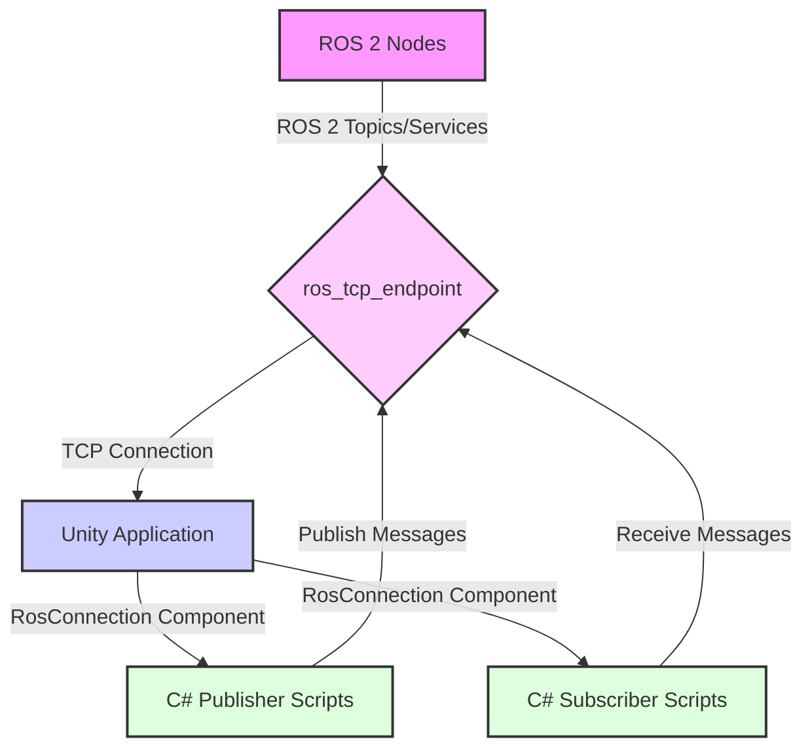

import Tabs from '@theme/Tabs';
import TabItem from '@theme/TabItem';

# Unity for Robotics: Setup and ROS 2 Integration

## Learning Objectives

After completing this chapter, you will be able to:

-   Set up the Unity development environment for robotics applications.
-   Understand the role and components of the Unity Robotics Hub.
-   Integrate ROS 2 with Unity using the `ROS-TCP-Connector` package.
-   Publish and subscribe to ROS 2 topics from within a Unity application.
-   Control Unity game objects and their properties using ROS 2 messages.
    - Debug Unity-ROS 2 integrated applications effectively.

## Core Theory

### Setting Up Unity for Robotics Development

Unity, a powerful real-time 3D development platform, is increasingly being adopted in robotics for high-fidelity simulation, visualization, and human-robot interaction. Its advanced rendering capabilities, physics engine, and extensive asset store make it an attractive alternative or complement to traditional robotics simulators like Gazebo.

**Key Steps for Unity Setup:**

1.  **Install Unity Hub**: The Unity Hub is a management tool that helps you manage multiple Unity projects and installations. Download it from the [Unity website](https://unity3d.com/get-unity/download).
2.  **Install Unity Editor**: Through the Unity Hub, install a recommended Long Term Support (LTS) version of the Unity Editor. Ensure you include the **Windows Build Support (IL2CPP)** module if you plan to build standalone Windows applications, and **Linux Build Support** if deploying to Linux systems.
3.  **Create a New Unity Project**: Open Unity Hub, select `New Project`, and choose a 3D template (e.g., `3D Core`). Give your project a suitable name and location.

### The Unity Robotics Hub

To streamline robotics development within Unity, the [Unity Robotics Hub](https://github.com/Unity-Technologies/Unity-Robotics-Hub) is a crucial resource. It provides a collection of packages, tools, and examples designed to facilitate the integration of Unity with various robotics frameworks, most notably ROS and ROS 2.

**Core Components of Unity Robotics Hub:**

-   **ROS-TCP-Connector**: This is the primary package for enabling communication between Unity and ROS/ROS 2. It sets up a TCP server/client architecture, allowing Unity to publish and subscribe to ROS topics and call/provide ROS services.
-   **ROS#-Sharp**: A C# library that mirrors ROS message definitions, allowing you to use ROS messages directly within Unity scripts.
-   **URDF Importer**: A tool to import Universal Robot Description Format (URDF) files directly into Unity, automatically generating a 3D model with colliders and rigidbodies based on the URDF specification.
-   **Robotics-specific Utilities**: Various helper scripts and components for common robotics tasks, such as camera rendering, LiDAR simulation, and joint control.

**Installation of ROS-TCP-Connector:**

1.  **Open Unity Project**: Open your newly created Unity project.
2.  **Open Package Manager**: In Unity, go to `Window > Package Manager`.
3.  **Add package from Git URL**: Click the `+` icon in the top-left corner, and select `Add package from git URL...`.
4.  **Enter URL**: Enter the URL for the `ROS-TCP-Connector` package, typically from the Unity Robotics Hub GitHub repository (e.g., `https://github.com/Unity-Technologies/ROS-TCP-Connector.git?path=/com.unity.ros_tcp_connector`). You might need to specify a version tag if you want a stable release (e.g., `#v0.7.0`).
5.  **Install Dependencies**: The Package Manager will automatically resolve and install any dependencies. You may be prompted to install `Burst` and `Collections` packages if they are not already present. Install them.

Once installed, you will see a new `ROS` menu item at the top of the Unity Editor, indicating that the `ROS-TCP-Connector` is ready for configuration.

### Code Example 2.3.1: Simple Unity Scene Setup

This example will guide you through setting up a basic Unity scene that will serve as our environment for ROS 2 integration. We will create a ground plane and a simple cube that we can later control via ROS 2.

#### 2.3.1.1 Create the Scene Elements

1.  **Open your Unity Project**.
2.  **Create a 3D Object - Plane**: In the Unity Editor, right-click in the Hierarchy window, select `3D Object > Plane`. Rename it `GroundPlane`. Set its Position to `(X:0, Y:0, Z:0)` and Scale to `(X:5, Y:1, Z:5)` in the Inspector window.
3.  **Create a 3D Object - Cube**: Right-click in the Hierarchy window, select `3D Object > Cube`. Rename it `RobotCube`. Set its Position to `(X:0, Y:0.5, Z:0)` (to place it on the plane) and Scale to `(X:0.2, Y:0.2, Z:0.2)`.
4.  **Add a Rigidbody to the Cube**: With `RobotCube` selected, click `Add Component` in the Inspector window and search for `Rigidbody`. This will allow the cube to be affected by physics (gravity, forces) and enable accurate position/rotation updates.

#### 2.3.1.2 Create a C# Script for Basic Movement (Optional)

While we will soon control this cube via ROS 2, it's good practice to understand how to write a basic movement script in Unity. This script will give the cube a simple forward motion, which can be useful for testing before ROS 2 integration.

1.  **Create a new C# Script**: In the Project window, right-click in the `Assets` folder, select `Create > C# Script`. Name it `CubeController`.
2.  **Edit the Script**: Double-click `CubeController` to open it in your IDE (Visual Studio, VS Code, Rider). Replace its content with:

    ```csharp
    using UnityEngine;

    public class CubeController : MonoBehaviour
    {
        public float moveSpeed = 1.0f;
        public float rotateSpeed = 50.0f;

        void FixedUpdate()
        {
            // Get input for movement (e.g., W/S keys or Up/Down arrows)
            float verticalInput = Input.GetAxis("Vertical");
            // Get input for rotation (e.g., A/D keys or Left/Right arrows)
            float horizontalInput = Input.GetAxis("Horizontal");

            // Apply forward/backward movement
            Vector3 moveDirection = transform.forward * verticalInput * moveSpeed * Time.fixedDeltaTime;
            GetComponent<Rigidbody>().MovePosition(GetComponent<Rigidbody>().position + moveDirection);

            // Apply rotation
            Quaternion turnRotation = Quaternion.Euler(0f, horizontalInput * rotateSpeed * Time.fixedDeltaTime, 0f);
            GetComponent<Rigidbody>().MoveRotation(GetComponent<Rigidbody>().rotation * turnRotation);
        }
    }
    ```
    *Note*: We use `FixedUpdate` for physics-related movements to ensure consistent behavior.

3.  **Attach the Script to the Cube**: Drag the `CubeController` script from the Project window onto the `RobotCube` GameObject in the Hierarchy. You will see the script appear as a component in the Inspector.
4.  **Test the Scene (Optional)**:
    -   Run the scene by clicking the Play button in the Unity Editor.
    -   Use the `W`, `A`, `S`, `D` keys (or arrow keys) to move and rotate the `RobotCube`.

This basic setup provides a visual environment and a physics-enabled cube ready for advanced control, including integration with ROS 2.

### Code Example 2.3.2: ROS 2 Publisher/Subscriber in Unity

This example demonstrates how to establish basic ROS 2 communication within Unity. We will create two C# scripts: one to publish a simple integer count to a ROS 2 topic, and another to subscribe to a `geometry_msgs/Twist` message to control the `RobotCube`.

#### 2.3.2.1 ROS 2 Setup (Outside Unity)

Before diving into Unity scripts, ensure you have a functional ROS 2 environment. We will use `ros_tcp_endpoint` to bridge the ROS 2 network with Unity.

1.  **Install `ros_tcp_endpoint`**: If you haven't already, install the `ros_tcp_endpoint` package in your ROS 2 workspace:
    ```bash
    cd ~/ros2_ws/src
    git clone https://github.com/Unity-Technologies/ROS-TCP-Endpoint.git
    cd ..
    rosdep install --from-paths src --ignore-src -r -y
    colcon build --packages-select ros_tcp_endpoint
    source install/setup.bash
    ```

2.  **Launch the ROS TCP Endpoint**: In a terminal, run the endpoint:
    ```bash
    ros2 launch ros_tcp_endpoint endpoint.launch.py
    ```
    This will start a TCP server that Unity will connect to.

3.  **Create a ROS 2 `cmd_vel` publisher (for testing)**:
    For testing the subscriber, you can use the `teleop_twist_keyboard` package or a simple Python publisher:

    ```bash
    # Using teleop_twist_keyboard (if installed)
    ros2 run teleop_twist_keyboard teleop_twist_keyboard

    # Or a simple Python script (e.g., `simple_cmd_vel_publisher.py`)
    # import rclpy
    # from rclpy.node import Node
    # from geometry_msgs.msg import Twist

    # class SimpleCmdVelPublisher(Node):
    #     def __init__(self):
    #         super().__init__('simple_cmd_vel_publisher')
    #         self.publisher_ = self.create_publisher(Twist, 'cmd_vel', 10)
    #         timer_period = 0.5  # seconds
    #         self.timer = self.create_timer(timer_period, self.timer_callback)
    #         self.i = 0

    #     def timer_callback(self):
    #         msg = Twist()
    #         msg.linear.x = 0.5 # Move forward
    #         msg.angular.z = 0.2 # Turn
    #         self.publisher_.publish(msg)
    #         self.get_logger().info(f'Publishing: "{msg.linear.x}, {msg.angular.z}"')

    # def main(args=None):
    #     rclpy.init(args=args)
    #     node = SimpleCmdVelPublisher()
    #     rclpy.spin(node)
    #     node.destroy_node()
    #     rclpy.shutdown()

    # if __name__ == '__main__':
    #     main()
    ```

#### 2.3.2.2 Unity Publisher Script (`SimplePublisher.cs`)

This script will publish an integer counter to a ROS 2 topic named `/unity_chatter`.

1.  **Generate ROS 2 messages**: In Unity, go to `ROS > Generate ROS-TCP-Connector Messages`. This will generate C# classes for standard ROS 2 messages. You might need to specify your ROS 2 message path (e.g., `~/ros2_ws/install/share`).
2.  **Create a new C# Script**: In the Project window (`Assets` folder), right-click, select `Create > C# Script`. Name it `SimplePublisher`.
3.  **Edit the Script**: Replace its content with:

    ```csharp
    using RosMessageTypes.Std;
    using RosNet.RosTcpConnector;
    using UnityEngine;

    public class SimplePublisher : MonoBehaviour
    {
        public RosConnection rosConnection;
        public string topicName = "/unity_chatter";
        public float publishMessageFrequency = 1.0f;

        private float timeElapsed;
        private int counter;

        void Start()
        {
            // Ensure the RosConnection is assigned in the Inspector
            if (rosConnection == null)
            {
                Debug.LogError("RosConnection not assigned to SimplePublisher.");
                enabled = false;
                return;
            }
            rosConnection.RegisterPublisher<Int32Msg>(topicName);
        }

        void Update()
        {
            timeElapsed += Time.deltaTime;
            if (timeElapsed > publishMessageFrequency)
            {
                Int32Msg message = new Int32Msg(counter);
                rosConnection.Publish(topicName, message);
                Debug.Log($"Unity Published: {counter}");
                counter++;
                timeElapsed = 0;
            }
        }
    }
    ```

4.  **Create a `ROSConnection` GameObject**: In your Unity scene, create an empty GameObject (right-click Hierarchy > `Create Empty`). Rename it `ROSConnectionManager`. Add a `ROSConnection` component to it (`Add Component` > `ROSConnection`). Set the `Ros IP Address` to your ROS 2 machine's IP (e.g., `127.0.0.1` for localhost) and `Ros Port` to `10000` (default for `ros_tcp_endpoint`).
5.  **Attach `SimplePublisher` to an Object**: Attach the `SimplePublisher` script to any GameObject in your scene (e.g., `RobotCube`). In its Inspector, drag the `ROSConnectionManager` (which has the `ROSConnection` component) into the `Ros Connection` field.

#### 2.3.2.3 Unity Subscriber Script (`CubeControllerROS.cs`)

This script will subscribe to a `geometry_msgs/Twist` topic (e.g., `/cmd_vel`) and use the received linear and angular velocities to control the `RobotCube`.

1.  **Create a new C# Script**: In the Project window, right-click, select `Create > C# Script`. Name it `CubeControllerROS`.
2.  **Edit the Script**: Replace its content with:

    ```csharp
    using RosMessageTypes.Geometry;
    using RosNet.RosTcpConnector;
    using UnityEngine;

    public class CubeControllerROS : MonoBehaviour
    {
        public RosConnection rosConnection;
        public string topicName = "/cmd_vel";
        public float linearSpeed = 1.0f;
        public float angularSpeed = 1.0f;

        private Rigidbody rb;

        void Start()
        {
            rb = GetComponent<Rigidbody>();
            if (rb == null)
            {
                Debug.LogError("Rigidbody not found on CubeControllerROS object.");
                enabled = false;
                return;
            }
            if (rosConnection == null)
            {
                Debug.LogError("RosConnection not assigned to CubeControllerROS.");
                enabled = false;
                return;
            }
            rosConnection.RegisterSubscriber<TwistMsg>(topicName, ApplyTwistMessage);
            Debug.Log($"Unity Subscribed to {topicName}");
        }

        void ApplyTwistMessage(TwistMsg twistMessage)
        {
            // Apply linear velocity
            Vector3 linearVelocity = new Vector3(
                (float)twistMessage.linear.x * linearSpeed,
                (float)twistMessage.linear.y * linearSpeed,
                (float)twistMessage.linear.z * linearSpeed
            );
            rb.velocity = transform.TransformDirection(linearVelocity);

            // Apply angular velocity
            Vector3 angularVelocity = new Vector3(
                (float)twistMessage.angular.x * angularSpeed,
                (float)twistMessage.angular.y * angularSpeed,
                (float)twistMessage.angular.z * angularSpeed
            );
            rb.angularVelocity = transform.TransformDirection(angularVelocity);

            Debug.Log($"Unity Received Twist: Linear=({twistMessage.linear.x}, {twistMessage.linear.y}), Angular=({twistMessage.angular.z})");
        }
    }
    ```

6.  **Attach `CubeControllerROS` to the Cube**: Remove the old `CubeController` script from `RobotCube` (if you added it) and attach the `CubeControllerROS` script to the `RobotCube` GameObject. Drag the `ROSConnectionManager` into its `Ros Connection` field.

#### 2.3.2.4 Running the Example

1.  **Launch `ros_tcp_endpoint`**: Ensure `ros2 launch ros_tcp_endpoint endpoint.launch.py` is running in your ROS 2 terminal.
2.  **Run Unity Scene**: Play your Unity scene (`SimplePublisher` and `CubeControllerROS` should be attached to GameObjects and linked to `ROSConnectionManager`).
3.  **Observe Publisher**: Check your ROS 2 terminal for `unity_chatter` messages:
    ```bash
    ros2 topic echo /unity_chatter
    ```
4.  **Control Cube**: In a separate ROS 2 terminal, publish `Twist` messages to `/cmd_vel` (e.g., using `teleop_twist_keyboard` or your custom Python publisher).

    **Expected behavior**: The `RobotCube` in Unity should move and rotate according to the `Twist` messages published on the `/cmd_vel` topic, and your ROS 2 terminal should show integer messages from `/unity_chatter`. This demonstrates bi-directional ROS 2 communication with Unity.

### Diagram 2.3.1: Unity-ROS 2 Bridge Architecture



## Hands-on Exercise 2.3.1: Extending Unity-ROS 2 Integration with Custom Messages

**Goal**: Create a custom ROS 2 message, generate its C# equivalent in Unity, and use it to exchange more complex data between a ROS 2 node and a Unity script.

1.  **Define a Custom ROS 2 Message (e.g., `RobotStatus.msg`)**:
    In your ROS 2 workspace (e.g., `~/ros2_ws/src/my_ros2_package/msg/RobotStatus.msg`):

    ```
    string robot_name
    int32 battery_level
    float32 temperature
    bool charging
    geometry_msgs/Pose current_pose
    ```
    Remember to update `package.xml` and `CMakeLists.txt` for your ROS 2 package to build this custom message.

2.  **Build your ROS 2 workspace**:
    ```bash
    cd ~/ros2_ws
    colcon build
    source install/setup.bash
    ```

3.  **Generate C# Messages in Unity**:
    In Unity, go to `ROS > Generate ROS-TCP-Connector Messages`. Ensure your ROS 2 workspace `install/share` path is correctly specified so Unity can find your new `RobotStatus` message.

4.  **Create a ROS 2 Python Publisher (`robot_status_publisher.py`)**:
    Create a Python node that publishes `RobotStatus` messages. It should populate all fields, including a `geometry_msgs/Pose`.

    ```python
    # ... (imports for rclpy, Node, RobotStatus, Pose)

    class RobotStatusPublisher(Node):
        # ... (init, timer_callback, publish RobotStatus messages)
    ```

5.  **Create a Unity Subscriber Script (`RobotStatusDisplay.cs`)**:
    Create a new C# script in Unity (`RobotStatusDisplay.cs`). This script will subscribe to the `/robot_status` topic, receive `RobotStatusMsg` messages, and display the robot's status (e.g., battery, temperature, pose) in the Unity console or as UI text.

    ```csharp
    using RosMessageTypes.Geometry;
    using RosMessageTypes.MyRos2Package;
    using RosNet.RosTcpConnector;
    using UnityEngine;

    public class RobotStatusDisplay : MonoBehaviour
    {
        public RosConnection rosConnection;
        public string topicName = "/robot_status";

        void Start()
        {
            if (rosConnection == null)
            {
                Debug.LogError("RosConnection not assigned to RobotStatusDisplay.");
                enabled = false;
                return;
            }
            rosConnection.RegisterSubscriber<RobotStatusMsg>(topicName, DisplayRobotStatus);
            Debug.Log($"Unity Subscribed to {topicName}");
        }

        void DisplayRobotStatus(RobotStatusMsg statusMessage)
        {
            Debug.Log($"Robot: {statusMessage.robot_name}, Battery: {statusMessage.battery_level}%, Temp: {statusMessage.temperature}°C, Charging: {statusMessage.charging}");
            Debug.Log($"Pose: Position=({statusMessage.current_pose.position.x}, {statusMessage.current_pose.position.y}), Orientation=({statusMessage.current_pose.orientation.z})");
            // You can also update UI Text elements or GameObjects based on this data
        }
    }
    ```

6.  **Attach `RobotStatusDisplay` to an object**: Attach the `RobotStatusDisplay` script to an empty GameObject in your Unity scene and link it to your `ROSConnectionManager`.

7.  **Run and Verify**:
    -   Ensure `ros_tcp_endpoint` is running.
    -   Run your `robot_status_publisher.py` node.
    -   Play your Unity scene.

    **Expected behavior**: Unity's console should display the detailed robot status messages published from your ROS 2 node, demonstrating successful integration with custom message types.

## Summary & Further Reading

In this chapter, we explored the powerful integration of Unity with ROS 2, enabling high-fidelity simulations and visualizations for robotics. You learned how to set up your Unity development environment, leverage the Unity Robotics Hub, and establish bi-directional communication using the `ROS-TCP-Connector`. Through practical code examples, you gained experience in publishing data from Unity to ROS 2 and controlling Unity game objects based on ROS 2 messages, even extending to custom message types.

**Key Takeaways:**

-   Unity offers a robust platform for creating visually rich and physically accurate robotic simulations.
-   The Unity Robotics Hub, particularly the `ROS-TCP-Connector`, simplifies the integration of Unity with ROS 2.
-   You can seamlessly exchange standard and custom ROS 2 messages between Unity and your ROS 2 network.

**Further Reading:**

-   **Unity Robotics Hub GitHub**: [https://github.com/Unity-Technologies/Unity-Robotics-Hub](https://github.com/Unity-Technologies/Unity-Robotics-Hub)
-   **ROS-TCP-Connector Documentation**: [https://github.com/Unity-Technologies/ROS-TCP-Connector/blob/main/docs/ros_tcp_connector.md](https://github.com/Unity-Technologies/ROS-TCP-Connector/blob/main/docs/ros_tcp_connector.md)
-   **ROS 2 Foxy Documentation**: [https://docs.ros.org/en/foxy/index.html](https://docs.ros.org/en/foxy/index.html)
-   **Unity Manual - Rigidbody**: [https://docs.unity3d.com/Manual/class-Rigidbody.html](https://docs.unity3d.com/Manual/class-Rigidbody.html)